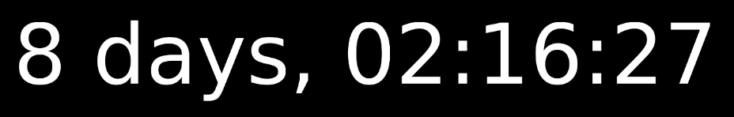
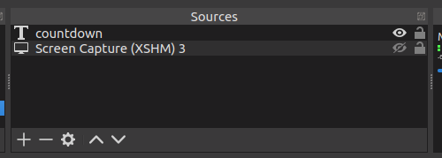
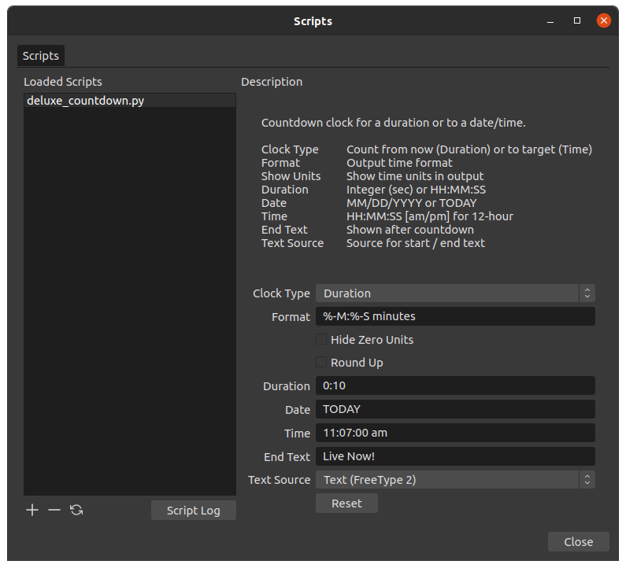

# OBS Deluxe Countdowm
### An enhanced countdown timer script for Open Broadcaster Software

## INSTALLATION

### Download

Save the file, [deluxe_countdown.py](https://github.com/joelgraff/obs-deluxe-countdown/blob/master/deluxe_countdown.py) to the OBS scripts directory. The script need not be saved in any specific folder.

### Create Sources

- Open OBS and in an empty scene, create a new source by clicking on the "+" icon at the bottom of the sources window:
- Add a "Screen Capture" source and click OK twice (you can turn the source off by clicking the eye icon).
- Add a Text source and name it "countdown".


Scene sources should look as follows:



### Add The Script

- Select "Tools -> Scripts" from the top menu
- Click the "+" button at the lower left of the sciprts dialog to add a new script.
- Navigate to the folder where the deluxe_countdown.py script file is located and select "Open"
- Select the new script to begin configuring the countdown timer.

## Configuration

### Script "not available"

If, after selecting the script, the properties dialog at right simply tells you that the script is "not available", it's likely Python3 is not installed / configured properly.  At the time of this writing, the current version of OBS supports Python3.6.

If Python3.6 is not already installed, it can be installed form the Python3 Releases page for the desired platform here:

https://www.python.org/downloads/release/python-368/

(Note that Python 3.6.8 is the last release of python that comes with pre-com0piled binaries)

After installing Python 3.6, click on the "Pytohn Settings" tab in the OBS Scripts dialog and browse to the location of the Python 3.6 install.  The location varies by platform.  Under Windows, it's often in the user's director under AppData\Local\Programs\Python36.

Once the proper location is selected, you may need to restart OBS for the change to take effect.  The properties panel, however, should now populate for the script.

### Configuration




#### Clock Type
  Duration - Countdown a specific amount of time from reset / now.
  Time - Countdown from now toward a specifc date / time.

#### Format
  Specify the time format as HH:MM:SS.  Time elements may be reduced or eliminated.

  Examples:

```
 For a given time of 12:34:56 and 12:04:06:

 - HH:MM:SS   12:34:56, 12:04:06
 - HH:MM:S    12:34:56, 12:04:6
 - HH:MM      12:34, 12:04
```

#### Show Units
  Display time units (verbose) if checked, use HH:MM:SS format otherwise.

  Examples:

```
 For a given time of 12:34:56:

 - Unchecked  12:34:56
 - Checked    12 hours, 34 minutes, 56 seconds
```

  It may be desirable to use single-digit time formats in combination with
  showing units.

  Examples:

```
  Given Time:   02:34:06 and Show Units = True / Checked

  HH:MM:SS  02 hours, 34 minutes, 06 seconds
  H:M:S     2 hours, 34 minutes 6 seconds
```

#### Duration
  Timer counts down the specified time from the moment the time is entered or the timer is reset.
  Values may be an integer or floating point number in minutes or HH:MM:SS format.
```
 - 23.5        23 minutes, 30 seconds
 - 23          23 minutes
 - 23:45       23 minutes, 45 seconds
 - 23:45:15    23 hours, 45 minutes, 15 seconds
```

#### Date/Time
  Timer counts down to the target date / time from the current date / time.  Reseting the timer has noe effect.

  The date may be spcified in MM/DD/YYYY format or the literal "TODAY" to ensure the current day's date is used.
  The time box indicates the target time in 12-hour or 24-hour format.  12-hour format must use "am" or "pm".
```
 - 3:15:00 am  3:15 in the morning
 - 15:35       3:45 in the afternoon
```

#### End Text
  The text which replaces the timer when the countdown terminates or invalid values are entered.


#### Reset Button
  Click to reset the timer (duration timer only).


## Contact

You can reach me at monograff76@gmail.com, or file an issue here on github.
