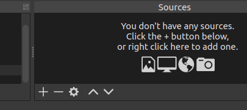

# OBS Deluxe Countdowm
### An enhanced countdown timer script for Open Broadcaster Software

## INSTALLATION

Save the file, [deluxe_countdown.py](https://github.com/joelgraff/obs-deluxe-countdown/blob/master/deluxe_countdown.py) to the OBS scripts directory.
The script need not be saved in any specific folder.

Once downloaded, open OBS and in an empty scene, create a new source
by clicking on the "+" icon at the bottom of the sources window:

Add a "Screen Capture" source and click OK twice.
You can turn the source off by clicking the eye icon.

Then, add a Text source and name it "countdown"

When you're done, your scene sources should look as follows:

Now, select "Tools -> Scripts" from the menu at the top of the OBS window
and click the "+" button at the lower left to add a new script.

Navigate to the folder where the deluxe_countdown.py script file is located
and select "Open"

Select the new script to begin configuring the countdown timer.

## Configuration

Configuring the timer is stratightforward.  The desctiption at the top
provides hints on valid input for the text boxes.

### Interval Type
Select "Duration" or "Date/Time" from the dropdown.

Duration timers count down the time specified in the Duration textbox
from the moment the time is entered or the timer is reset.

Date/Time timers count down to the target date / time from the current
time.  Reseting the timer will have no effect on a Date/Time timer.

### Duration
Timer duration may be specified as an integer or floating point value
indicating the total number of minutes, or in HH:MM:SS format.

Duration input is parsed as follows:

23.5        23 minutes, 30 seconds
23          23 minutes
23:45       23 minutes, 45 seconds
23:45:15    23 hours, 45 minutes, 15 seconds

### Date
The date box indicates the date toward which the countdown occurs.

The date may be spcified in MM/DD/YYYY format or the literal "TODAY"
to ensure the current day's date is used.

### Time
The time box indicates the target time.  This may be specified in
12-hour or 24-hour format.  Note that 12-hour format must use "am" or "pm".

### End Text
The text which replaces the timer when the countdown terminates.

### Resetting
Click the reset button at any time to reset the timer (duration timer only).

## Contact

You can reach me at monograff76@gmail.com, or file an issue here on github.